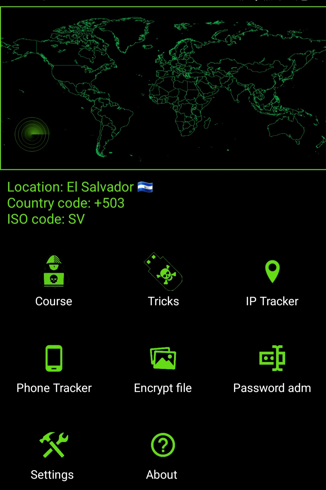

# X092
Ethical Hacking course for Android 

The course is now available for android devices with SDK 32 and minimum 21. This includes 33 topics about hacking from basic to expert level and it comes with a list of tricks.

In addition to this, the app now comes with some tools you can use to encrypt files and protect your files. And also you can now use the OSIN tools to track IP address and phone numbers which uses an API that provides accurate information.

